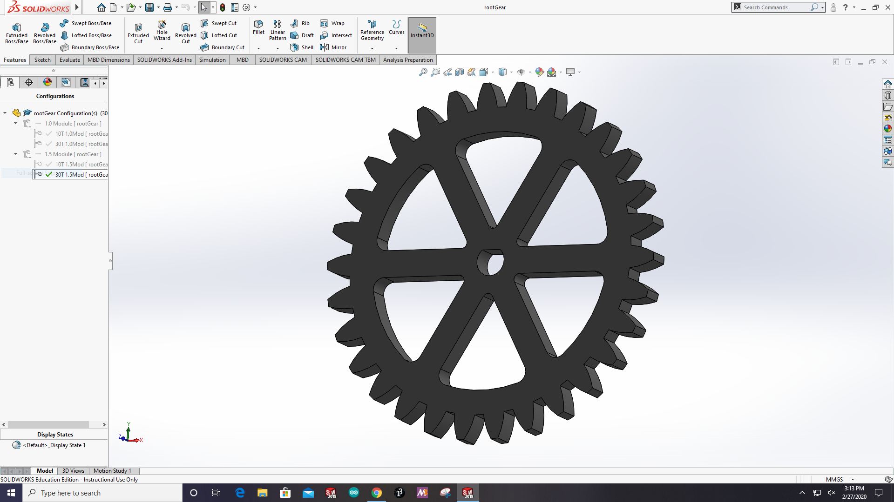
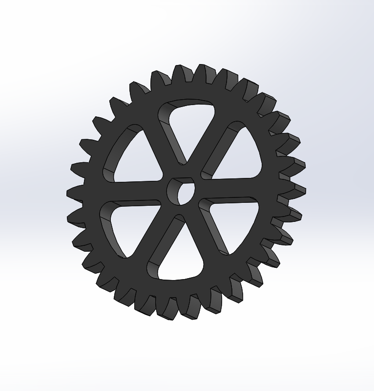
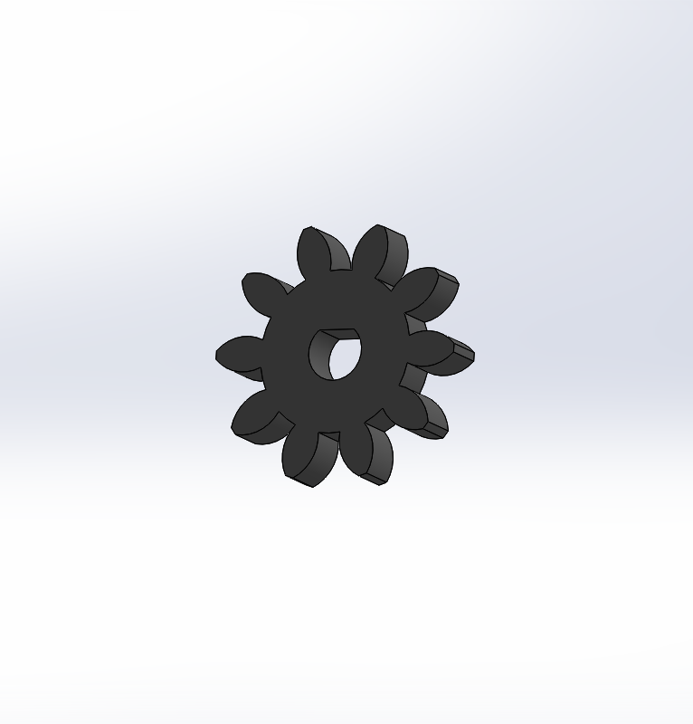
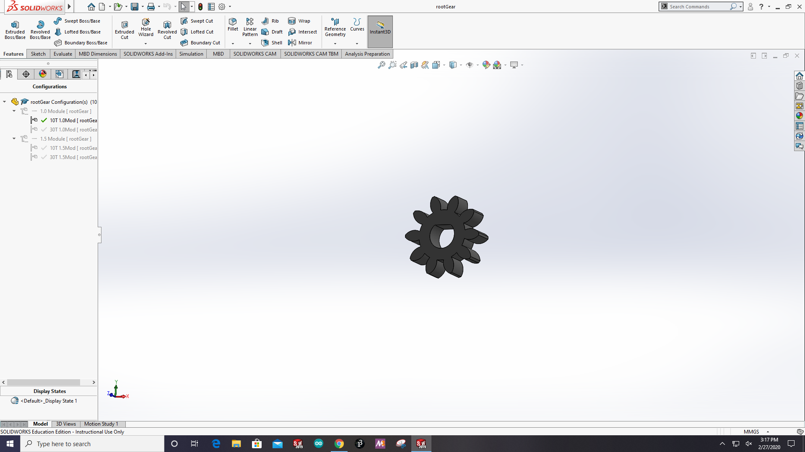
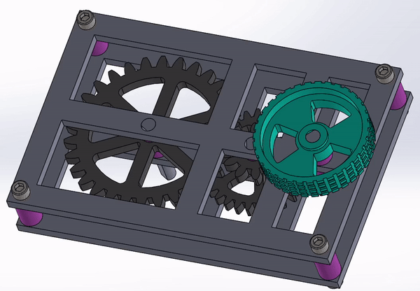
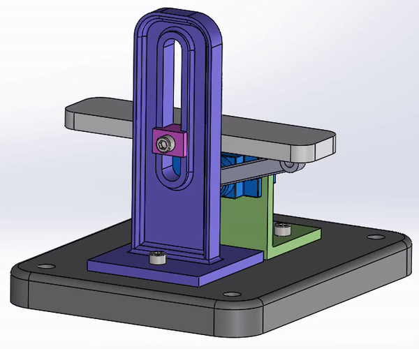

# Advanced-CAD

## Gears
#### Included Files
<a href="Gears/rootGear.SLDPRT">rootGear.SLDPRT</a> 
 
In this assignment I made reusable gears using equations. Each dimension can be changed and the gear will function the same, allowing for infinite reuse. I learned some gear terms and refreshed my knowledge of configurations and equations in Solidworks.
  

## Gearbox
#### Included Files
<a href="Gears/GearboxAssem.SLDASM">GearboxAssem.SLDASM</a> 
<a href="Gears/GearboxSubAssem1.SLDASM">GearboxSubAssem1.SLDASM</a> 
<a href="Gears/GearboxSubAssem2.SLDASM">GearboxSubAssem2.SLDASM</a> 
<a href="Gears/GearboxSubAssem3.SLDASM">GearboxSubAssem3.SLDASM</a> 
<a href="Gears/axle.SLDPRT">axle.SLDPRT</a> 
<a href="Gears/knob.SLDPRT">knob.SLDPRT</a> 
<a href="Gears/plate.SLDPRT">plate.SLDPRT</a> 
<a href="Gears/rootGear.SLDPRT">rootGear.SLDPRT</a> 
<a href="Gears/spacer.SLDPRT">spacer.SLDPRT</a> 
 
In this assignment I made a gear box. I started by making spacers and axles, each with configurations to increase efficiency. Then, I made three subassemblies of each axle, and a frame to hold them together. The final touch was making a knob to turn the gears with and then mating it all together. I came back to this assignment after doing Motion Study to animate the gears turning.  
 
 

## Motion Study
#### Included Files
<a href="MotionStudy/Micro Servo FS90R Continuous.SLDPRT">Micro Servo FS90R Continuous.SLDPRT</a> 
<a href="MotionStudy/MotionStudyAssem.SLDASM">MotionStudyAssem.SLDASM</a> 
<a href="MotionStudy/base.SLDPRT">base.SLDPRT</a> 
<a href="MotionStudy/bracket.SLDPRT">bracket.SLDPRT</a> 
<a href="MotionStudy/clip.SLDPRT">clip.SLDPRT</a> 
<a href="MotionStudy/servoArm.SLDPRT">servoArm.SLDPRT</a> 
<a href="MotionStudy/servoMount.SLDPRT">servoMount.SLDPRT</a> 
<a href="MotionStudy/shelf.SLDPRT">shelf.SLDPRT</a> 

  
## Stress Analysis
#### Included Files
<a href="StressAnalysis/Arm.SLDPRT">Arm.SLDPRT</a> 
